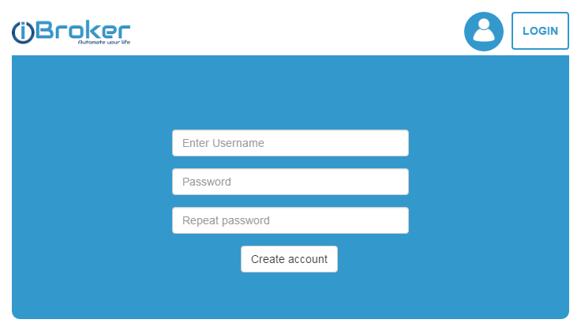
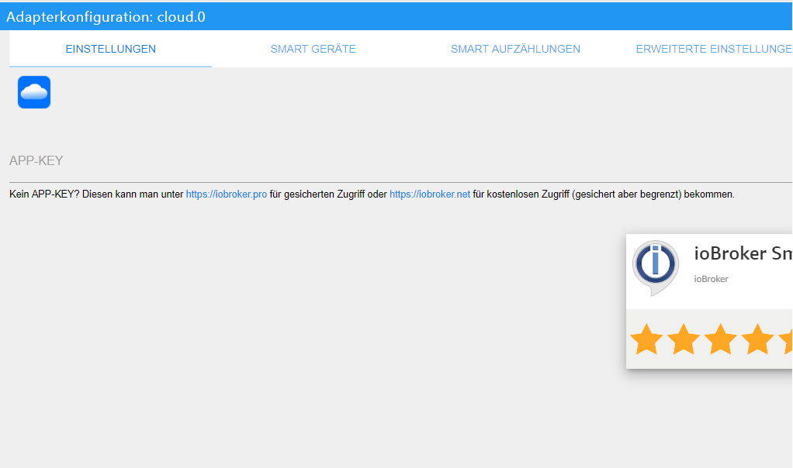
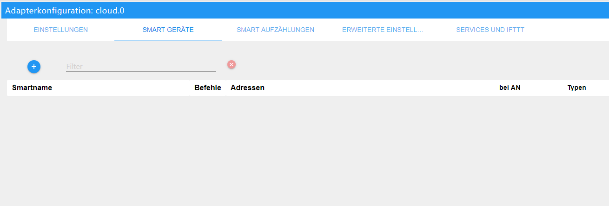

# ioBroker cloud Adapter
Dieser Adapter ermöglicht die Verbindung vom Internet über die ioBroker-Cloud zur lokalen Installation von ioBroker.

## Einstellungen
### APP-KEY
Um den Cloud-Adapter verwenden zu können, muss zunächst ein Account unter [https://iobroker.net](https://iobroker.net) erstellt werden.



Über Edit Profile dann den APP-Key kopieren und hier eintragen.



### Instanz
Alle Anfragen des Cloud-Adapter werden an eine WEB-Instanz weitergeleitet. Der Benutzer muss hier die WEB-Instanz (meist web.0) angeben, die dem Benutzer angezeigt wird, wenn er sich auf der Website https://iobroker.net anmeldet.

## Erweiterte Einstellungen
### Verbindungs-Timeout(ms)
Erklärung fehlt

### Ping-Timeout(ms)
Erklärung fehlt

### Sprache
Bei Auswahl der Systemsprache werden die Smart-Namen von Geräten und Aufzählungen nicht übersetzt. Wenn eine Sprache angegeben ist, werden alle bekannten Namen in diese Sprache übersetzt.
Dies dient zum schnellen wechseln zwischen den Sprachen.

### Erlaube selbst-signierte Zertifikate
Bei Verwendung der iobroker.net Cloud bleibt dies deaktiviert. Diese Option wird nur bei Verwendung einer eigenen Cloud benötigt.

### Platziere Funktionsnamen vorne
Hiermit wird die Reihenfolge von Funktion und Rolle in selbst generierten Namen geändert:

- deaktiviert : "Raum Funktion", Beispiel: "Wohnzimmer Dimmer"
- aktiviert: "Funktion Raum", Beispiel: "Dimmer Wohnzimmer"

### Verbinde Raum und Funktion mit
Hier kann ein Wort definiert werden, das zwischen Funktion und Raum platziert wird. Mit eingesetzem "im" wird aus "Dimmer Wohnzimmer" "Dimmer im Wohnzimmer".

Dies wird jedoch nicht empfohlen, da die Erkennungs-Engine ein weiteres Wort analysieren muss und dies zu Missverständnissen führen kann.

### Ersetze in Namen
Hier können Zeichenfolgen angeben werden, die automatisch in den Gerätenamen ersetzt werden. 

Beispiel: Bei ```.STATE,.LEVEL``` werden alle ".STATE" und ".LEVEL" aus den Namen gelöscht. Vorsicht mit Leerzeichen, wenn  ```.STATE, .LEVEL``` eingesetzt wird, wird ".STATE" und " .LEVEL"ersetzt und nicht ".LEVEL".

### Aus-Pegel für Schalter
Einige Gruppen haben unterschiedliche Geräten: z.B. Dimmer und Schalter. Diese können mit den Befehlen "EIN" und "AUS" oder auch mit Prozentwerten gesteuert werden. Wenn der Befehl "Setze auf 30%" lautet und der Aus-Pegel auf "30%" eingestellt ist, werden die Schalter eingeschaltet. Mit dem Befehl "Setze auf 25%" werden alle Schalter ausgeschaltet die Dimmer werden auf 25% gesetzt, bleiben also an.

Mit dem Befehl "AUS" speichert der Adapter außerdem den aktuellen Dimmerpegel, wenn der tatsächliche Wert über oder gleich "30%" ist .
Mit einem neuen "EIN"-Befehl schaltet der Adapter einen Dimmer nicht auf 100%, sondern auf den gespeicherten Pegel.

Beispiel:

- Angenommen, der Aus-Pegel steht auf 30%.
- Ein virtuelles Gerät "Licht" hat zwei physische Geräte: *Schalter* und *Dimmer*.
- Mit dem Befehl "Setze das Licht auf 40%" wird dieser Wert für den *Dimmer* gespeichert, setzt den "Dimmer" auf diesen Wert und schaltet den *Schalter* ein.
- Mit dem Befehl "Schalte das Licht aus" wird der *Dimmer* auf 0% gesetzt und der *Schalter* wird ausgeschaltet.
- Befehl: "Schalte das Licht ein". *Dimmer* => 40%, *Schalter* => Ein.
- Befehl: "Setze das Licht auf 20%". *Dimmer* => 20%, *Schalter* => Aus. Der Wert für den Dimmer wird nicht gespeichert, da unter dem Aus-Pegel.
- Befehl: "Schalte das Licht ein". *Dimmer* => 40%, *Schalter* => Ein.

### Schreibe Antwort ins
Für jeden Befehl wird die Textantwort generiert. Hier kann die Objekt-ID definiert werdenen, in die dieser Text geschrieben werden muss. Z.B. * sayit.0.tts.text *.

### Neustart bei Verbindunsabbruch
Erklärung fehlt

### Erlaube Zugriff auf Admin (nur pro)
Erklärung fehlt

### Eigene Einstellungen (nur pro)
Erklärung fehlt

## Services und IFTTT
### IFTTT
[Anleitung IFTTT](doc/ifttt.md)

### White list für Services
There is a possibility to send messages to cloud adapter.
If you call ```[POST]https://iobroker.net/service/custom_<NAME>/<user-app-key>``` und value as payload.

```
curl --data "myString" https://iobroker.net/service/custom_test/<user-app-key>
```

If you set in the settings the field "White list for services" the name *custom_test*, and call with "custom_test" as the service name, the state **cloud.0.services.custom_test** will be set to *myString*.

You may write "*" in white list and all services will be allowed.

From version 2.0.5 you can use GET request in form ```[GET]https://iobroker.net/service/custom_<NAME>/<user-app-key>/<data>``` to place the **\<data\>** into **cloud.0.services.custom_\<NAME\>**.

Here you can find instructions how to use it with [tasker](doc/tasker.md).

IFTTT service is allowed only if IFTTT key is set.

Reserved names are "ifttt", "text2command", "simpleApi", "swagger". These must be used without the ```"custom_"``` prefix.

### text2command
You may write "text2command" in white list, you can send POST request to ```https://iobroker.net/service/text2command/<user-app-key>``` to write data into *text2command.X.text* variable.

"X" can be defined in settings by the "Use text2command instance" option.

### simpleApi
*to do*

### Lock
Um die Sperren sperren zu können, muss der Status die Rolle "switch.lock" und native.LOCK_VALUE haben, um den Sperrstatus zu bestimmen.

```
Alexa, is "lock name" locked/unlocked
Alexa, lock the "lock name"
```

## Wie Namen generiert werden
Der Adapter versucht, virtuelle Geräte für die Smart Home-Steuerung zu generieren (z.B. Amazon Alexa oder Google Home).

Dafür gibt es zwei wichtige Aufzählungen: Räume und Funktionen.

Räume sind z.B: Wohnzimmer, Bad, Schlafzimmer.

Funktionen sind z.B.: Licht, Jalousie, Heizung.

Folgende Bedingungen müssen erfüllt sein, um einen Objektstatus automatisch in die Liste aufzunehmen:

- Der Objektstatus muss in der Aufzählung "Funktion" enthalten sein.
- Der Zustand muss eine Rolle haben ("state", "switch" oder "level.*",  z.B. level.dimmer), wenn er nicht direkt in "Funktion" enthalten ist. Es ist möglich, dass der Kanal sich in "Funktion" befindet, der Objektstatus selbst aber nicht.
- Der Objektstatus muss beschreibbar sein: common.write = true.
- Der Objektstatus eines Dimmer muss common.type = 'number' sein.
- Der Obkjetstatus Heizung muss als common.unit in '°C', '°F' or '°K' und der common.type als 'number' beschrieben sein.

Befindet sich der Objektstatus nur in "Funktion" und nicht in einem "Raum", wird der Name des Objektstatus verwendet.

Die Zustandsnamen werden aus Funktion und Raum generiert. Z.B. werden alle *Lichter* im *Wohnzimmer* im virtuellen Gerät als *Wohnzimmerlichter* generiert. Da er automatisch generiert wird kann der Benutzer diesen Namen nicht ändern. Jedoch wird der Aufzählungsname geändert, ändert sich auch der Name des virtuellen Geräts. (z.B. ändert sich die Funktion "Licht" in "Lichter", ändert sich *Wohnzimmerlichter* in *Wohnzimmerlichter*)

Alle diese Bedingungen werden ignoriert, wenn der Objektstatus den Wert common.smartName hat. In diesem Fall wird nur der Smart Name verwendet.

Falls der Wert von *common.smartName* **false** ist, wird der Objektstatus nicht bei der Listengenerierung berücksichtigt.

Über den Konfigurationsdialog können die einzelnen Objektstati bequem über das + Zeichen zu virtuellen Gruppen oder als einzelnes Gerät hinzufügt werden. Löschen erfolt über den Papierkorb rechts. Ein Smartname kann mit dem Bleistift geändert werden.


Wenn eine Gruppe nur einen Status hat, kann sie umbenannt werden, da hierfür der SmartName des Status verwendet wird.

Wenn die Gruppe mehr als einen Status hat, muss die Gruppe über die Namen der Aufzählung umbenannt werden.

Um eigene Gruppen zu erstellen, kann der "Szenen-Adapter" installieren werden oder ein "Skript" im Javascript-Adapter erstellt werden.


## Helper states
- **smart.lastObjectID**: This state will be set if only one device was controlled by home skill (alexa, google home).
- **smart.lastFunction**: Function name (if exists) for which last command was executed.
- **smart.lastRoom**:     Room name (if exists) for which last command was executed.
- **smart.lastCommand**:  Last executed command. Command can be: true(ON), false(OFF), number(%), -X(decrease at x), +X(increase at X)
- **smart.lastResponse**: Textual response on command. It can be sent to some text2speech (sayit) engine.


